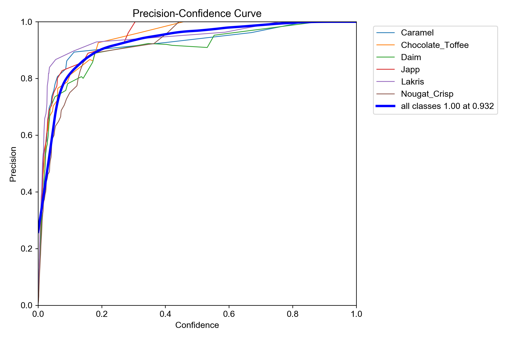
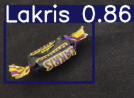

# YOLO Objektdeteksjon med Maskinlæring


---
[](#)


### Innholdsfortegnelse
**Del 1 – Oppgavekrav**
- [Hva er Ultralytics YOLO og objektdeteksjon?](#hva-er-ultralytics-yolo-og-objektdeteksjon)
- [Om prosjektet](#om-prosjektet)
- [Om modellen](#om-modellen)
- [Annotering og oppbygging av datasett](#annotering-og-oppbygging-av-datasett)
- [mAP](#map)
- [Konfidensscore og boundingbox](#konfidensscore-og-boundingbox)
- [Feilsøkningsmetoder](#feilsøkningsmetoder)
- [Filstruktur og filforklaring](#filstruktur-og-filforklaring)
- [Etikk og personvern](#etikk-og-personvern)

**Del 2 – Teknisk dokumentasjon**
- [Arkitektur-prinsipper](#arkitektur-prinsipper)
- [Biblioteker og begrunnelse](#biblioteker-og-begrunnelse)
- [Sikkerhet og personvern](#sikkerhet-og-personvern)
- [Installasjon og oppsett](#installasjon-og-oppsett)
- [Feilsøkings-strategier](#feilsøkings-strategier)


---

# Hva er Ultralytics YOLO og objektdeteksjon?

**Ultralytics YOLO** er en populær rammeverk for objektdeteksjon i sanntid. YOLO står for *"You Only Look Once"*, og navnet kommer av at modellen analyserer hele bildet i én operasjon, i stedet for å dele det opp i mindre deler. Dette gjør YOLO-modellene **ekstremt raske**, samtidig som de opprettholder høy nøyaktighet.

**Objektdeteksjon** er en teknikk innen maskinlæring og datavitenskap som går ut på å identifisere og lokalisere objekter i bilder eller video. Når en modell utfører objektdeteksjon, tegner den såkalte *bounding boxes* (rektangulære rammer) rundt objektene den gjenkjenner. I tillegg klassifiserer modellen hvert objekt, for eksempel som "bil", "person" eller – i dette prosjektet – "Twist-sjokolade".

YOLO-modeller trenes på store datasett med annoterte bilder, der hvert objekt er merket med en boks 

---

# Om prosjektet
Yolo-objektdeteksjon handler om maskinlæring og KI. I dette prosjektet bruker jeg en ferdigtrent YOLO-modell som kun fokuserer på objektgjenkjenning av et valgfritt objekt. Prosjektet er en halvårsvurderings mappeoppgave ettersom jeg har vært lærling i snart 1 år.

Applikasjonen støtter to deteksjonsmoduser:
- **Live deteksjon** via webkamera med sanntids FPS-visning
- **Bildedeteksjon** der brukeren velger en bildefil som analyseres og lagres med markerte objekter

Alle deteksjoner logges automatisk til en CSV-fil med tidsstempel, klasse, konfidensgrad og koordinater.


## Om modellen
Som grunnmodell har jeg brukt YOLO11n, som ble lansert høsten 2024. Denne modellen er rask og nøyaktig, noe som gjør den perfekt for sanntidsdeteksjon. Det er viktig å bruke en YOLO-modell som passer fint til ditt bruksområde og at utvalgt modell passer til din hardware. Jeg valgte derfor YOLO11n fordi den er god for trening og live deteksjon, som var et viktig krav for dette prosjektet. 

Ved å trene modellen på egne datasett, har jeg tilpasset den fra å gjenkjenne generelle objekter til å spesialisere den på seks ulike typer Twist-sjokolader. Treningen ble gjennomført over 60 epochs, noe som har gitt modellen god presisjon på treningsdataene.


## Annotering og oppbygging av datasett

Jeg bygde datasettet gradvis for å sikre god kvalitet og variasjon i treningsdataene.

### Startfasen
Først samlet jeg **~90 bilder** av alle objektene, med følgende innhold:
- **Nærbilder** av hvert objekt
- **Bilder av alle objekter sammen** med ulike bakgrunner
- **Bilder med varierende støy** (fra lite til mye forstyrrelser)

### Formål med variasjon
Bildene ble tatt fra **forskjellige vinkler, former og bakgrunner** for å:
✅ Trene modellen på ulike scenarier
✅ Gjøre modellen **mer robust** mot variasjoner i miljø, bakgrunn og lys
✅ Forbedre gjenkjenningsnøyaktigheten i virkelige situasjoner

### Optimalisering av datasettet
Til slutt endte jeg opp med **205 bilder**. Den gradvise oppbyggingen gjorde det mulig å:
- Identifisere **hvilke objekter modellen gjenkjente godt**
- Finne **svake punkter** som krevde mer trening
- **Filtrere og fokusere** på de viktigste bildene for å skape et optimalt datasett


## mAP
Etter at min modell fikk trent igjennom treningsdataene fikk jeg en mAP-vurdering av modellen som sier litt om hvordan modellen klarer å gjenkjenne objektene. mAP står for mean Average Precision og gir meg et blikk av hva den er mer sikker på og hva den ikke er så sikker på. Dette har vært til god hjelp for å se hva slags data jeg må fokusere mer på for å få datagrunnlaget godt. 



### Konfidensscore og boundingbox
Etter trening og når jeg kjører trent modell med et bilde eller live deteksjon vil hvert objekt få en konfidensscore. Det sier hvor sikker modellen er for at objektet er f.eks. en Daim. Det betyr ikke at modellen har rett, men hvor sikker den er på at objektet er det den tror. 

Boundingbox er boksen modellen tegner rundt objektet med navn av objektet og konfidensscore, som til sammen sier:
- **Hvilket objekt den har funnet**
- **Hvor sikker den er**



### Feilsøkningsmetoder
Under prosjektet har jeg hatt stort fokus på datagrunnlaget. En feilsøkningsmetode jeg har brukt er hjelp fra min kollega som har gjort dette tidligere. Med den hjelpen så vi på datasettet og mAP-en og fikk satt opp en plan for å gjøre datasettet bedre for modellen. 

Jeg har også benyttet meg av Google og YouTube der jeg så hva andre har gjort og sett hvordan de har gjennomført lignende prosjekter. 

Dette har vært til stor hjelp med å fullføre prosjektet og har gjort det slik at store problemer underveis har blitt unngått. Planleggingen av prosjektet i forkant der jeg planla steg for steg og fikk brutt prosjektet inn i små deler hjalp mye, der jeg da fikk holdt fokuset på én spesifikk del av gangen. 

### Filstruktur og filforklaring

```
Yolo/
├── app.py                      # Hovedapplikasjon – meny, bildeopplasting og logging
├── kamera_deteksjon.py         # Modul for live kameradeteksjon
├── logg_deteksjon.py           # Felles loggefunksjon for CSV-skriving
├── best.pt                     # Ferdigtrent YOLO-modell (egendatasett)
├── yolo11n.pt                  # Basis YOLO11n-modell (nano)
├── deteksjoner.csv             # Loggfil – genereres automatisk ved deteksjon
├── Resultat.jpg                # Sist lagrede bildedeteksjon
│
├── datasett/
│   └── bilder/                 # ~205 råbilder brukt til trening og validering
│
└── yolo-objektdeteksjon/       # Utviklingshistorikk delt i faser
    ├── del1_grunnlegende/      # Første test av YOLO med ferdig modell
    │   └── test_yolo.py
    ├── del2_webkamera/         # Lagt til live kameradeteksjon
    ├── del3_egent_datasett/    # Eget datasett og trening av modell
    │   ├── tren_modell.py      # Script for å trene modellen
    │   ├── data.yaml           # Konfigurasjon for datasett (klasser, stier)
    │   ├── data/
    │   │   ├── train/          # Treningsbilder + labels
    │   │   └── validation/     # Valideringsbilder + labels
    │   └── tren_modell/        # Treningsresultater og grafer
    │       └── yolo11n_egent_datasett/
    │           ├── weights/    # Lagrede modellvekter (best.pt, last.pt)
    │           ├── results.png # Graf over treningsforløpet
    │           └── BoxP_curve.png, confusion_matrix.png ...
    └── del4_applikasjon/       # Ferdig applikasjon satt sammen
```

### Etikk og personvern

Objektdeteksjon med kamera reiser flere etiske spørsmål som er viktige å ta stilling til.

**Overvåking og samtykke**
Et kamera koblet til en deteksjonsmodell kan i prinsippet brukes til å overvåke personer uten at de er klar over det. Det er viktig at de som befinner seg i kameraets synsfelt vet om det og har gitt samtykke.

**GDPR og lagring av data**
I Norge og EU regulerer GDPR hvordan persondata skal håndteres. Bilder og videoopptak av personer regnes som persondata. 

**Feildeteksjon og konsekvenser**
Ingen modell er 100 % nøyaktig. Feilklassifisering kan i enkle systemer som dette føre til feil i statistikk, men i mer kritiske systemer (f.eks. ansiktsgjenkjenning i sikkerhet) kan feil få alvorlige konsekvenser for enkeltpersoner. Det er derfor viktig å kjenne til modellens begrensninger og bruke den innenfor dens styrker.

**Bruksområde og formål**
Teknologien i seg selv er nøytral – det er bruken som avgjør om den er etisk forsvarlig. Objektdeteksjon kan brukes til å hjelpe blinde, automatisere farlige arbeidsoppgaver eller effektivisere industri. Det kan også misbrukes til masseovervåking. Formålet bak systemet er derfor avgjørende.

---

> *Seksjonen under er generell teknisk dokumentasjon for prosjektet.*

---

### Arkitektur-prinsipper

Prosjektet er delt opp i separate moduler for å holde koden oversiktlig og vedlikeholdbar:

- **`app.py`** er inngangspunktet og håndterer brukerinteraksjon, bildeopplasting og CSV-logging
- **`kamera_deteksjon.py`** er isolert som en egen modul slik at live-deteksjonslogikken ikke blander seg med resten
- Modellen (`best.pt`) lastes inn lokalt og brukes av begge deteksjonsmodusene
- All logging skjer via en felles `logg_deteksjon()`-funksjon for å unngå kodeduplisering


### Biblioteker og begrunnelse

| Bibliotek | Bruksområde | Begrunnelse |
|---|---|---|
| `ultralytics` | YOLO-modell for objektdeteksjon | Enkel API for å laste og kjøre YOLO-modeller |
| `cv2` (OpenCV) | Kameraopptak og bildebehandling | Industristandard for sanntids videobehandling i Python |
| `inquirer` | Interaktiv meny i terminalen | Gir et brukervennlig menyvalg uten GUI |
| `tkinter` | Filvelger-dialog | Innebygd i Python, enkel løsning for å åpne filer grafisk |
| `csv` | Logging av deteksjoner | Lettvektsformat som er enkelt å analysere i etterkant |
| `datetime` | Tidsstempel på deteksjoner | Gjør det mulig å spore når objekter ble oppdaget |


### Sikkerhet og personvern

- Webkameraet aktiveres kun når brukeren eksplisitt velger "Start live deteksjon" og avsluttes umiddelbart når brukeren trykker `q`.
- Ingen bilder fra kameraet lagres — kun koordinater og klasse logges til CSV.
- Ved bildedeteksjon velger brukeren selv hvilken fil som analyseres via en filvelger-dialog.
- Loggfilen `deteksjoner.csv` lagres lokalt og deles ikke med noen ekstern tjeneste.


### Installasjon og oppsett

**Forutsetninger:**
- Python 3.10 eller nyere
- Et webkamera (for live deteksjon)

**Steg:**

1. Klon prosjektet:
   ```bash
   git clone <repo-url>
   cd Yolo
   ```

2. Installer avhengigheter:
   ```bash
   pip install ultralytics opencv-python inquirer
   ```

3. Kontroller at `best.pt` ligger i rotmappen.

4. Start applikasjonen:
   ```bash
   python app.py
   ```

5. Velg ønsket modus fra menyen:
   - **Start live deteksjon** – Åpner kameravindu. Trykk `q` for å avslutte.
   - **Legg til bilde for deteksjon** – Åpner filvelger. Resultatet lagres som `Resultat.jpg`.
   - **Avslutt** – Avslutter programmet.


### Feilsøkings-strategier

| Problem | Mulig årsak | Løsning |
|---|---|---|
| `Feil ved innlesning av kamera` | Kameraet er i bruk av et annet program | Lukk andre apper som bruker kameraet og prøv igjen |
| Modellen lastes ikke inn | `best.pt` mangler i rotmappen | Kontroller at filen ligger riktig plassert |
| Lav FPS under live deteksjon | For tung maskinvare eller feil modell | Bruk `yolo11n.pt` (nano) i stedet for en større modell |
| Ingen fil valgt i filvelger | Dialogen ble lukket uten valg | Prøv igjen og velg en `.jpg`, `.jpeg` eller `.png`-fil |
| `deteksjoner.csv` opprettes ikke | Ingen deteksjon ble gjennomført | Kjør en deteksjon — filen opprettes automatisk ved første loggoppføring |
