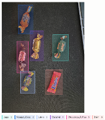

# YOLO Objektdeteksjon med Maskinlæring


---
[](#)


### Innholdsfortegnelse
- [Om prosjektet](#om-prosjektet)
- [Om modellen](#Om-modellen)
- [Annoterings prosessen](#Annoterings-prosessen)
- [Prosjektstruktur](#prosjektstruktur)
- [Arkitektur-prinsipper](#arkitektur-prinsipper)
- [Biblioteker og begrunnelse](#biblioteker-og-begrunnelse)
- [Teori](#teori)
- [Sikkerhet og personvern](#sikkerhet-og-personvern)
- [Installasjon og oppsett](#installasjon-og-oppsett)
- [Feilsøkings-strategier](#feilsøkings-strategier)


# Om prosjektet
Yolo-objektdeteksjon handler om maskinlæring og KI. I dette prosjektet bruker jeg en ferdigtrent YOLO-modell som kun fokuserer på objektgjenkjenning av et valgfritt objekt. Prosjektet er en halvårsvurderings mappeoppgave etter som jeg har vært lærling i snart 1 år.

Applikasjonen støtter to deteksjonsmoduser:
- **Live deteksjon** via webkamera med sanntids FPS-visning
- **Bildedeteksjon** der brukeren velger en bildefil som analyseres og lagres med markerte objekter

Alle deteksjoner logges automatisk til en CSV-fil med tidsstempel, klasse, konfidensgrad og koordinater.


## Om modellen
Som grunnmodell har jeg brukt YOLO11n, som ble lansert høsten 2024. Denne modellen er rask og nøyaktig, noe som gjør den perfekt for sanntidsdeteksjon. Det er viktig å bruke en Yolo modell som passer fint til dit bruks område og at utvalgt modell passer til din hardware. Jeg valgte derfor Yolo11n for at den er god for trening og live deteksjon som var et viktig krav for dette prosjektet. 

Ved å trene modellen på egne datasett, har jeg tilpasset den fra å gjenkjenne generelle objekter til å spesialisere den på seks ulike typer Twist-sjokolader. Treningen ble gjennomført over 60 epochs, noe som har gitt modellen god presisjon på treningsdataene.


## Annotering og oppbygging av datasett

Jeg bygde datasettet gradvis for å sikre god kvalitet og variasjon i treningsdataene.

### Startfasen
Først samlet jeg **~90 bilder** av alle objektene, med følgende innhold:
- **Nærbilder** av hvert objekt
- **Bilder av alle objekter sammen** med ulike bakgrunner
- **Bilder med varierende støy** (fra lite til mye forstyrrelser)

### Formål med variasjon
Bildene ble tatt fra **forskjellige vinkler, former og bakgrunner** for å:
✅ Trene modellen på ulike scenarier
✅ Gjøre modellen **mer robust** mot variasjoner i miljø, bakgrunn og lys
✅ Forbedre gjenkjenningsnøyaktigheten i virkelige situasjoner

### Optimalisering av datasettet
Til slutt endte jeg opp med **205 bilder**. Den gradvise oppbyggingen gjorde det mulig å:
- Identifisere **hvilke objekter modellen gjenkjente godt**
- Finne **svake punkter** som krevde mer trening
- **Filtrere og fokusere** på de viktigste bildene for å skape et optimalt datasett


## mAP
Etter at min modell fikk trent igjennom treningsdatane fikk en jeg mAP vurdering av modellen som sier litt om hvordan modellen klarer å gjennkjenne objektene. mAP står for mean Average Precision og gir en meg et blikk av hva den er mer sikker på og hva den ikke er så sikker på. Dette har vert god hjlep for å se hva slags data jeg få fokusere mer på for å få datagrunnlaget godt. 


### konfidensscore
Etter trening og når jeg kjører trent modell med et bilde eller live deteksjon vil hvert objekt få en konfidensscore. Det sier hvor sikker modellen er for at objektet er f.eks. en Daim. Det betyr ikke at modellen har rett, men hvor siker den er at objektet er det den trur. 


### Prosjektstruktur

```
Yolo/
├── app.py                  # Hovedapplikasjon med interaktiv meny
├── kamera_deteksjon.py     # Modul for live kameradeteksjon
├── best.pt                 # Trent YOLO-modell
├── yolo11n.pt              # Basis YOLO-modell (nano)
├── datasett/               # Treningsbilder og datasett
├── deteksjoner.csv         # Loggfil for deteksjoner (genereres ved kjøring)
└── Resultat.jpg            # Sist lagrede bildedeteksjon (genereres ved kjøring)
```


### Arkitektur-prinsipper

Prosjektet er delt opp i separate moduler for å holde koden oversiktlig og vedlikeholdbar:

- **`app.py`** er inngangspunktet og håndterer brukerinteraksjon, bildeopplasting og CSV-logging
- **`kamera_deteksjon.py`** er isolert som en egen modul slik at live-deteksjonslogikken ikke blander seg med resten
- Modellen (`best.pt`) lastes inn lokalt og brukes av begge deteksjonsmodusene
- All logging skjer via en felles `logg_deteksjon()`-funksjon for å unngå kodeduplisering


### Biblioteker og begrunnelse

| Bibliotek | Bruksområde | Begrunnelse |
|---|---|---|
| `ultralytics` | YOLO-modell for objektdeteksjon | Enkel API for å laste og kjøre YOLO-modeller |
| `cv2` (OpenCV) | Kameraopptak og bildebehandling | Industristandard for sanntids videobehandling i Python |
| `inquirer` | Interaktiv meny i terminalen | Gir et brukervennlig menyvalg uten GUI |
| `tkinter` | Filvelger-dialog | Innebygd i Python, enkel løsning for å åpne filer grafisk |
| `csv` | Logging av deteksjoner | Lettvektsformat som er enkelt å analysere i etterkant |
| `datetime` | Tidsstempel på deteksjoner | Gjør det mulig å spore når objekter ble oppdaget |


### Teori

**YOLO (You Only Look Once)** er en rask og nøyaktig objektdeteksjonsalgoritme. I motsetning til eldre metoder som deler opp bildeanalysen i flere steg, behandler YOLO hele bildet i én enkelt gjennomkjøring av nettverket. Dette gjør den svært rask og egnet for sanntidsdeteksjon.

**Viktige begreper:**

- **Konfidensgrad** – Et tall mellom 0 og 1 som sier hvor sikker modellen er på en deteksjon. I dette prosjektet brukes en minimumsgrense på 0.40 (40%).
- **IoU (Intersection over Union)** – Måler overlapp mellom to bounding boxes. Brukes i NMS for å fjerne duplikatdeteksjoner.
- **NMS (Non-Maximum Suppression)** – Fjerner overlappende deteksjoner slik at hvert objekt kun markeres én gang.
- **Bounding box** – Det rektangulære området som markerer et oppdaget objekt i bildet.
- **Trening** – Modellen (`best.pt`) er trent på et eget datasett lagret i `datasett/`-mappen med egendefinerte bilder.


**bounding box**
- **bounding box er en boks rektangelet rundt objektet**
- **Den kan beskrives med koordinater: x1, y1, x2, y2**


**konfidensscore**
- **Konfidensscore er hvor sikker modellen er**
- **Eksempel: kopp: 0.87**
- **Det betyr at modellen er 87 % sikker på at objektet er en kopp**


**annotering**
Annotering betyr at du manuelt markerer objekter i bildene og sier hva de er. 
- **Dette bruker modellen for å se hva slags objekt som den skal trenes på**
- **Dette bir modellen navn på objektet**




**mAP**
- **mAP står for mean Average Precision**
- **Det er en måling på hvor godt modellen finner objekter og plasserer bounding boxes riktig**

mAP sier noe om hvor presis modellen er på valideringsdata. En høyere mAP betyr at modellen generelt treffer bedre på både klasse og plassering.


**Deteksjonsproblem**
Under live-deteksjon kan modellen av og til feilidentifisere objekter som holdes opp, spesielt når de ligner på andre objekter den er trent på. Selv om modellen raskt korrigerer seg og gjenkjenner riktig objekt, kan den midlertidig forveksle objekter under bevegelse.


### Sikkerhet og personvern

- Webkameraet aktiveres kun når brukeren eksplisitt velger "Start live deteksjon" og avsluttes umiddelbart når brukeren trykker `q`.
- Ingen bilder fra kameraet lagres — kun koordinater og klasse logges til CSV.
- Ved bildedeteksjon velger brukeren selv hvilken fil som analyseres via en filvelger-dialog.
- Loggfilen `deteksjoner.csv` lagres lokalt og deles ikke med noen ekstern tjeneste.


### Installasjon og oppsett

**Forutsetninger:**
- Python 3.10 eller nyere
- Et webkamera (for live deteksjon)

**Steg:**

1. Klon prosjektet:
   ```bash
   git clone <repo-url>
   cd Yolo
   ```

2. Installer avhengigheter:
   ```bash
   pip install ultralytics opencv-python inquirer
   ```

3. Kontroller at `best.pt` ligger i rotmappen.

4. Start applikasjonen:
   ```bash
   python app.py
   ```

5. Velg ønsket modus fra menyen:
   - **Start live deteksjon** – Åpner kameravindu. Trykk `q` for å avslutte.
   - **Legg til bilde for deteksjon** – Åpner filvelger. Resultatet lagres som `Resultat.jpg`.
   - **Avslutt** – Avslutter programmet.


### Feilsøkings-strategier

| Problem | Mulig årsak | Løsning |
|---|---|---|
| `Feil ved innlesning av kamera` | Kameraet er i bruk av et annet program | Lukk andre apper som bruker kameraet og prøv igjen |
| Modellen lastes ikke inn | `best.pt` mangler i rotmappen | Kontroller at filen ligger riktig plassert |
| Lav FPS under live deteksjon | For tung maskinvare eller feil modell | Bruk `yolo11n.pt` (nano) i stedet for en større modell |
| Ingen fil valgt i filvelger | Dialogen ble lukket uten valg | Prøv igjen og velg en `.jpg`, `.jpeg` eller `.png`-fil |
| `deteksjoner.csv` opprettes ikke | Ingen deteksjon ble gjennomført | Kjør en deteksjon — filen opprettes automatisk ved første loggoppføring |
